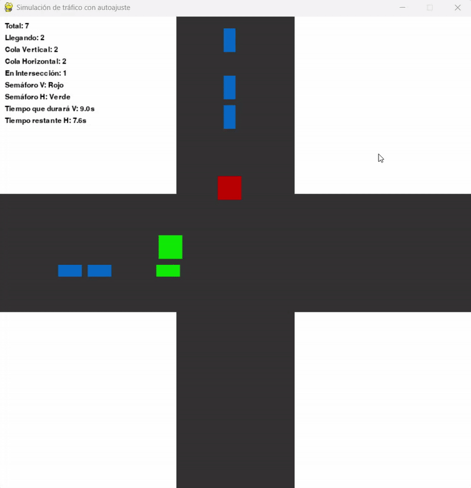

# Laboratorio 1 - Sistemas Adaptativos
Simulación de calle con coches, junto con un sistema de autoajuste para cambiar el color de los semaforos

La formula para autoajustar la duración de la luz verde de los semaforos es la siguiente:
> duracion(seg) = duracion_minima(seg) + números_de_coches * 2(seg)

## Ejecución
1. Clona el repositorio
```sh
git clone https://github.com/ManuelMaganaL/sisada-lb1
```
2. Entra en el repo
```sh
cd sisada-lb1
```
3. Instala las dependencias necesarias
```sh
pip install -r requirements.txt
```
4. Ejecuta el archivo main.py para ver la simulación
```sh
python src/main.py
```

## Ejemplo

